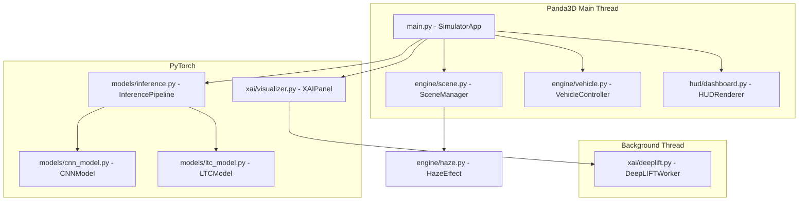

# Design Document: Self-Driving 3D Simulator

## Overview

The simulator is a Python application built on Panda3D that renders a real-time 3D road environment, feeds rendered frames through one of two trained self-driving models (CNN or LTC/CfC), applies vehicle physics from model outputs, and overlays a HUD dashboard and XAI attribution panel. The architecture separates concerns into five subsystems: Scene, Vehicle, Inference Pipeline, HUD, and XAI Panel — all coordinated by a central simulation loop in `main.py`.

The design prioritizes the simulator (90% of scope). Model definitions are thin wrappers that mirror the notebook architecture exactly. XAI computation is offloaded to a background thread to preserve 30 FPS.

---

## Architecture



### Data Flow Per Frame

```mermaid
sequenceDiagram
    participant Loop as SimulatorApp (main loop)
    participant Scene as SceneManager
    participant Infer as InferencePipeline
    participant Vehicle as VehicleController
    participant HUD as HUDRenderer
    participant XAI as XAIPanel

    Loop->>Scene: render frame
    Scene-->>Loop: camera texture (RGB)
    Loop->>Infer: run(frame, haze_active)
    Infer-->>Loop: ModelOutput(steering, gas, brake, gear)
    Loop->>Vehicle: update(output, dt)
    Loop->>HUD: draw(vehicle_state, output, sim_state)
    Loop->>XAI: maybe_update(frame, output)
    XAI-->>Loop: latest attribution image (non-blocking)
```

---

## Components and Interfaces

### SimulatorApp (`main.py`)

Central coordinator. Subclasses `panda3d.core.ShowBase`. Owns the main task loop, keyboard bindings, and references to all subsystems.

```python
class SimulatorApp(ShowBase):
    scene: SceneManager
    vehicle: VehicleController
    inference: InferencePipeline
    hud: HUDRenderer
    xai_panel: XAIPanel
    sim_state: SimState          # paused, haze_active, active_model, manual_override
    frame_counter: int

    def setup_keys(self) -> None: ...
    def main_loop(self, task) -> Task.cont: ...
    def toggle_pause(self) -> None: ...
    def toggle_haze(self) -> None: ...
    def switch_model(self, model_id: int) -> None: ...   # 1=CNN, 2=LTC
    def cycle_xai_output(self) -> None: ...
```

### SceneManager (`engine/scene.py`)

Manages the Panda3D scene graph: road tile pool, sky dome, vegetation, lighting, and the in-scene camera that captures frames for inference.

```python
class SceneManager:
    road_tiles: List[NodePath]
    tile_length: float           # meters per tile
    active_tiles: int            # tiles kept ahead of vehicle
    camera_node: NodePath        # attached to vehicle, captures inference frames
    fog: Optional[Fog]

    def __init__(self, base: ShowBase, config: Config) -> None: ...
    def update(self, vehicle_pos: Vec3, vehicle_heading: float) -> None: ...
    def capture_frame(self) -> np.ndarray: ...   # returns (224, 224, 3) uint8 RGB
    def set_haze(self, active: bool) -> None: ...
    def _spawn_tile(self, position: Vec3) -> NodePath: ...
    def _recycle_tile(self, tile: NodePath) -> None: ...
```

Road tiles are pre-loaded into a pool of 10 tiles and recycled as the vehicle advances. Each tile is a flat `CardMaker` quad with a tiled asphalt texture and lane-marking decal. The sky is a `SkyBox` using a CC0 HDR sky texture.

### HazeEffect (`engine/haze.py`)

Wraps Panda3D's `Fog` node and the OpenCV frame overlay.

```python
class HazeEffect:
    fog: Fog
    intensity: float             # default 0.6, matches training augmentation

    def apply_to_scene(self, render: NodePath) -> None: ...
    def remove_from_scene(self, render: NodePath) -> None: ...
    def apply_to_frame(self, frame: np.ndarray) -> np.ndarray:
        # cv2.addWeighted(frame, 1-intensity, white, intensity, 0)
        ...
```

### VehicleController (`engine/vehicle.py`)

Holds vehicle state and applies model outputs each frame.

```python
@dataclass
class VehicleState:
    position: Vec3
    heading: float       # degrees, 0=north
    speed: float         # km/h
    gear: int            # 0-5

class VehicleController:
    state: VehicleState
    max_speed: float = 120.0   # km/h
    node: NodePath             # Panda3D node for the car mesh

    def update(self, output: ModelOutput, dt: float) -> None: ...
    def apply_manual(self, steering: float, throttle: float, dt: float) -> None: ...
    def reset(self) -> None: ...
```

Physics model (simplified kinematic):
- `speed += (gas * accel_rate - brake * decel_rate) * dt`, clamped to [0, max_speed]
- `heading += (steering_degrees / max_steer) * turn_rate * (speed / max_speed) * dt`
- `position += forward_vector(heading) * speed * dt`

### CNNModel (`models/cnn_model.py`)

```python
class CNNModel(nn.Module):
    backbone: EfficientNetV2_S   # timm, pretrained=False at inference
    fc1: Linear(1280 -> 512)
    relu1: ReLU
    drop1: Dropout(0.3)
    fc2: Linear(512 -> 256)
    relu2: ReLU
    drop2: Dropout(0.2)
    fc3: Linear(256 -> 4)

    def forward(self, x: Tensor) -> Tensor: ...   # (B, 3, 224, 224) -> (B, 4)
```

### LTCModel (`models/ltc_model.py`)

```python
class LTCModel(nn.Module):
    backbone: EfficientNetV2_S   # timm
    adapter: Linear(1280 -> 128)
    ltc: AutoNCP(128, 4)         # ncps library, LTC or CfC wiring

    def forward(self, x: Tensor) -> Tensor: ...   # (B, 3, 224, 224) -> (B, 4)
    def reset_hidden(self) -> None: ...            # reset LTC hidden state between episodes
```

### InferencePipeline (`models/inference.py`)

```python
@dataclass
class ModelOutput:
    steering_degrees: float   # clamped [-122, 115]
    gas_pedal: float          # clamped [0, 1]
    brake_pedal: float        # clamped [0, 1]
    gear: int                 # clamped [0, 5]

class InferencePipeline:
    models: Dict[str, nn.Module]   # {"cnn": CNNModel, "ltc": LTCModel}
    active_key: str
    device: torch.device
    transform: transforms.Compose  # Resize(224), ToTensor, Normalize(ImageNet)
    haze_effect: HazeEffect
    inference_times: deque         # rolling window for logging

    def load_models(self, config: Config) -> None: ...
    def run(self, frame: np.ndarray, haze_active: bool) -> ModelOutput: ...
    def _preprocess(self, frame: np.ndarray, haze_active: bool) -> Tensor: ...
    def _clamp_output(self, raw: Tensor) -> ModelOutput: ...
    def switch_model(self, key: str) -> bool: ...
```

Preprocessing steps:
1. If `haze_active`: apply `HazeEffect.apply_to_frame(frame)`
2. Convert BGR→RGB, resize to 224×224
3. `transforms.ToTensor()` → `transforms.Normalize(mean=[0.485,0.456,0.406], std=[0.229,0.224,0.225])`
4. Add batch dim, move to device

### HUDRenderer (`hud/dashboard.py`)

Uses Panda3D's `DirectGui` and `OnscreenText` for overlay rendering. All elements are 2D nodes attached to `aspect2d`.

```python
class HUDRenderer:
    steering_arc: DirectArc      # custom drawn arc, -122 to +115 range
    gas_bar: DirectWaitBar
    brake_bar: DirectWaitBar
    gear_label: OnscreenText
    speed_label: OnscreenText
    frame_label: OnscreenText
    haze_label: OnscreenText
    model_label: OnscreenText
    pause_label: OnscreenText

    def update(self, state: VehicleState, output: ModelOutput, sim: SimState) -> None: ...
```

The steering arc is drawn as a `LineSegs` arc spanning the full [-122, +115] range with a needle indicator at the current angle.

### DeepLIFTWorker (`xai/deeplift.py`)

Runs in a `threading.Thread`. Uses a `queue.Queue` for input frames and a `threading.Lock`-protected result slot.

```python
class DeepLIFTWorker(threading.Thread):
    model: nn.Module
    input_queue: Queue           # (frame_tensor, output_index)
    result_lock: Lock
    latest_result: Optional[AttributionResult]
    running: bool

    def run(self) -> None: ...   # worker loop
    def submit(self, frame: Tensor, output_index: int) -> None: ...
    def get_latest(self) -> Optional[AttributionResult]: ...
    def stop(self) -> None: ...

@dataclass
class AttributionResult:
    original: np.ndarray         # (224, 224, 3) uint8
    heatmap: np.ndarray          # (224, 224, 3) uint8, hot colormap
    overlay: np.ndarray          # blended original + heatmap
    output_name: str             # "steering" | "gas" | "brake" | "gear"
    haze_label: str              # "HAZE" | "NON-HAZE"
```

DeepLIFT computation:
```python
dl = DeepLift(model)
attributions = dl.attribute(input_tensor, target=output_index)
attr_np = attributions.squeeze().cpu().numpy()          # (3, 224, 224)
attr_sum = np.sum(np.abs(attr_np), axis=0)              # (224, 224)
attr_norm = (attr_sum - attr_sum.min()) / (attr_sum.max() - attr_sum.min() + 1e-8)
heatmap = cv2.applyColorMap((attr_norm * 255).astype(np.uint8), cv2.COLORMAP_HOT)
overlay = cv2.addWeighted(original_bgr, 0.6, heatmap, 0.4, 0)
```

### XAIPanel (`xai/visualizer.py`)

Renders the `AttributionResult` as a side panel using Panda3D `OnscreenImage` nodes updated from the main thread.

```python
class XAIPanel:
    worker: DeepLIFTWorker
    update_interval: int         # frames between XAI updates, default 5
    frame_since_update: int
    xai_output_index: int        # 0-3
    panel_images: List[OnscreenImage]   # [original, heatmap, overlay]
    output_label: OnscreenText
    haze_label: OnscreenText

    def maybe_update(self, frame: np.ndarray, haze_active: bool) -> None: ...
    def cycle_output(self) -> None: ...
    def _refresh_display(self, result: AttributionResult) -> None: ...
    def switch_model(self, model: nn.Module) -> None: ...
```

---

## Data Models

### SimState

```python
@dataclass
class SimState:
    paused: bool = False
    haze_active: bool = False
    active_model: str = "cnn"    # "cnn" | "ltc"
    manual_override: bool = False
    xai_output_index: int = 0
    frame_counter: int = 0
```

### Config (`config.py`)

```python
@dataclass
class Config:
    cnn_model_path: str = "weights/cnn_model.pth"
    ltc_model_path: str = "weights/ltc_model.pth"
    xai_update_interval: int = 5
    target_fps: int = 30
    haze_intensity: float = 0.6
    manual_override: bool = False
    window_width: int = 1280
    window_height: int = 720
    max_speed_kmh: float = 120.0
    road_tile_length: float = 50.0    # meters
    road_tiles_ahead: int = 10
    log_inference_every: int = 100    # frames
```

### ModelOutput

```python
@dataclass
class ModelOutput:
    steering_degrees: float   # [-122.0, 115.0]
    gas_pedal: float          # [0.0, 1.0]
    brake_pedal: float        # [0.0, 1.0]
    gear: int                 # [0, 5]
```

---

## Correctness Properties

*A property is a characteristic or behavior that should hold true across all valid executions of a system — essentially, a formal statement about what the system should do. Properties serve as the bridge between human-readable specifications and machine-verifiable correctness guarantees.*


### Property 1: Road Tile Continuity

*For any* vehicle position along the road, the SceneManager should always have at least `road_tiles_ahead` tiles extending beyond the vehicle's current position, ensuring the road never ends during simulation.

**Validates: Requirements 1.5**

---

### Property 2: Haze Frame Blending

*For any* input RGB frame (any size, any pixel values), applying `HazeEffect.apply_to_frame()` should produce an output frame where each pixel value equals `round(original * (1 - intensity) + 255 * intensity)` within floating-point tolerance, matching the cv2.addWeighted contract.

**Validates: Requirements 2.1, 2.5**

---

### Property 3: Haze Toggle Round-Trip

*For any* initial haze state (active or inactive), toggling haze twice should return `SimState.haze_active` to its original value — i.e., `toggle(toggle(state)) == state`.

**Validates: Requirements 2.3**

---

### Property 4: Preprocessing Output Shape

*For any* input numpy frame of any valid image dimensions (H×W×3, uint8), `InferencePipeline._preprocess()` should always produce a tensor of shape `(1, 3, 224, 224)` with float32 dtype, regardless of the input resolution.

**Validates: Requirements 3.5**

---

### Property 5: Output Clamping Invariant

*For any* raw model output tensor (including extreme values, NaN-free), `InferencePipeline._clamp_output()` should always produce a `ModelOutput` where:
- `steering_degrees` ∈ [-122.0, 115.0]
- `gas_pedal` ∈ [0.0, 1.0]
- `brake_pedal` ∈ [0.0, 1.0]
- `gear` ∈ {0, 1, 2, 3, 4, 5}

**Validates: Requirements 3.8, 3.9, 3.10**

---

### Property 6: Vehicle Speed Invariant

*For any* vehicle state and any `ModelOutput`, after calling `VehicleController.update()`, the vehicle speed should always remain in [0.0, 120.0] km/h regardless of gas/brake values or time delta.

**Validates: Requirements 4.2, 4.3**

---

### Property 7: Vehicle Pause Invariant

*For any* vehicle state, calling `VehicleController.update()` while `SimState.paused == True` should leave `VehicleState.position`, `VehicleState.heading`, and `VehicleState.speed` completely unchanged.

**Validates: Requirements 4.5**

---

### Property 8: HUD Value Mapping Consistency

*For any* `ModelOutput`, the values passed to `HUDRenderer.update()` should be reflected exactly in the HUD display state: the gas bar value should equal `output.gas_pedal`, the brake bar value should equal `output.brake_pedal`, and the steering needle angle should be proportional to `output.steering_degrees` within the [-122, +115] arc range.

**Validates: Requirements 5.1, 5.2, 5.3**

---

### Property 9: Attribution Result Completeness

*For any* input frame tensor and output index, `DeepLIFTWorker` should produce an `AttributionResult` where `original`, `heatmap`, and `overlay` all have shape `(224, 224, 3)` and dtype `uint8`, and `output_name` is one of ["steering", "gas", "brake", "gear"].

**Validates: Requirements 6.1, 6.2**

---

### Property 10: XAI Update Interval Enforcement

*For any* update interval N > 0, calling `XAIPanel.maybe_update()` M times should submit exactly `floor(M / N)` jobs to the `DeepLIFTWorker` queue, never more.

**Validates: Requirements 6.3**

---

### Property 11: XAI Output Index Cycling

*For any* initial `xai_output_index` value in [0, 3], calling `XAIPanel.cycle_output()` exactly 4 times should return the index to its original value — i.e., cycling is modular with period 4.

**Validates: Requirements 6.4**

---

### Property 12: Pause Toggle Round-Trip

*For any* initial `SimState.paused` value, calling `toggle_pause()` twice should return `SimState.paused` to its original value.

**Validates: Requirements 8.1**

---

### Property 13: Config Default Fallback

*For any* subset of configuration keys omitted from config.py, `Config` should populate every missing key with its documented default value, and no `KeyError` or `AttributeError` should be raised during initialization.

**Validates: Requirements 9.2**

---

## Error Handling

| Scenario | Component | Behavior |
|---|---|---|
| CNN .pth not found | InferencePipeline | Log error, mark CNN unavailable, continue with LTC |
| LTC .pth not found | InferencePipeline | Log error, mark LTC unavailable, continue with CNN |
| Both .pth not found | InferencePipeline | Log critical error, sys.exit(1) |
| Switch to unavailable model | SimulatorApp | Display HUD error message, retain current model |
| XAI worker exception | DeepLIFTWorker | Log exception, continue with last valid result |
| Frame capture returns None | SceneManager | Skip inference for that frame, log warning |
| NaN in model output | InferencePipeline | Replace NaN with 0.0, log warning |
| Config key missing | Config | Use default value, log warning |
| GPU OOM during inference | InferencePipeline | Fall back to CPU, log warning |

---

## Testing Strategy

### Dual Testing Approach

Both unit tests and property-based tests are required and complementary:

- **Unit tests** cover specific examples, edge cases (missing model files, NaN outputs, empty frames), and integration points between components.
- **Property-based tests** verify universal correctness properties across randomly generated inputs, catching bugs that specific examples miss.

### Property-Based Testing Library

Use **Hypothesis** (Python) for all property-based tests. Configure each test with `@settings(max_examples=100)` minimum.

Each property test must be tagged with a comment referencing the design property:
```python
# Feature: self-driving-3d-simulator, Property N: <property_text>
@given(...)
@settings(max_examples=100)
def test_property_N_name(...):
    ...
```

### Property Test Implementations

| Property | Test Strategy |
|---|---|
| P2: Haze blending | `@given(st.arrays(np.uint8, (H, W, 3)))` → verify pixel formula |
| P3: Haze toggle round-trip | `@given(st.booleans())` → toggle twice, assert equal |
| P4: Preprocessing shape | `@given(st.integers(64,1024), st.integers(64,1024))` → random frame sizes |
| P5: Output clamping | `@given(st.floats(-1e6, 1e6) × 4)` → verify all bounds |
| P6: Speed invariant | `@given(VehicleState, ModelOutput, st.floats(0.01, 1.0))` → verify [0, 120] |
| P7: Pause invariant | `@given(VehicleState, ModelOutput)` → update while paused, assert unchanged |
| P8: HUD mapping | `@given(ModelOutput)` → verify display values match |
| P9: Attribution shape | `@given(st.arrays(np.float32, (1,3,224,224)))` → verify result shapes |
| P10: XAI interval | `@given(st.integers(1,20), st.integers(1,100))` → count submissions |
| P11: XAI cycling | `@given(st.integers(0,3))` → cycle 4 times, assert original |
| P12: Pause toggle | `@given(st.booleans())` → toggle twice, assert equal |
| P13: Config defaults | `@given(st.sets(st.sampled_from(CONFIG_KEYS)))` → omit keys, assert defaults |

### Unit Test Coverage

- Model loading: valid path, missing path, both missing
- Preprocessing: correct normalization values for known pixel inputs
- Output clamping: boundary values (exactly -122, exactly 115, 0, 1)
- Vehicle physics: zero speed with brake, max speed cap, heading wrap-around
- HUD rendering: label text matches sim state
- XAI worker: thread starts/stops cleanly, result slot updates correctly
- Config: all defaults, partial config, full config override
